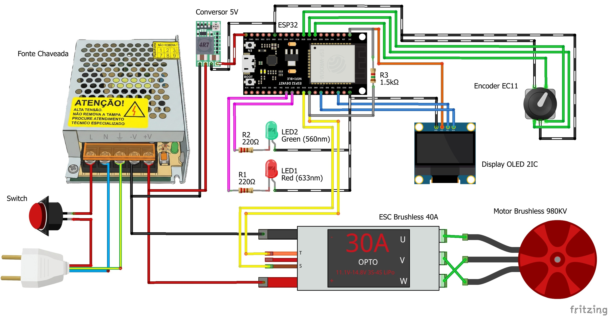
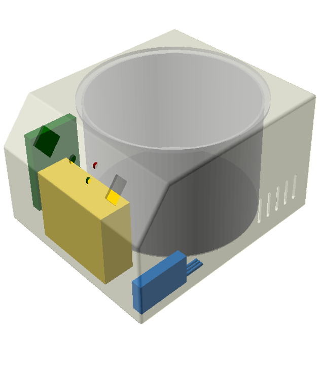
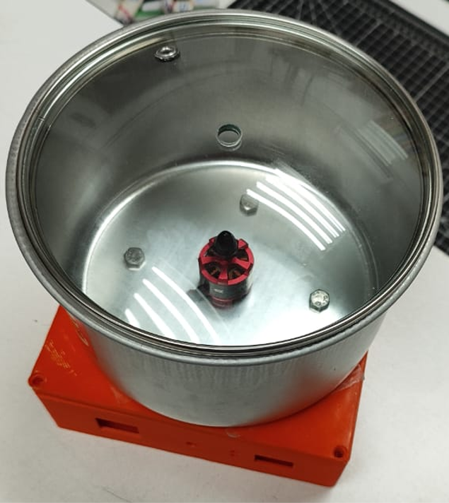
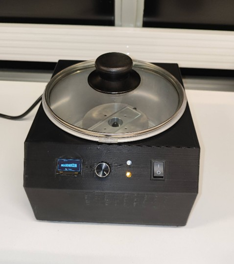
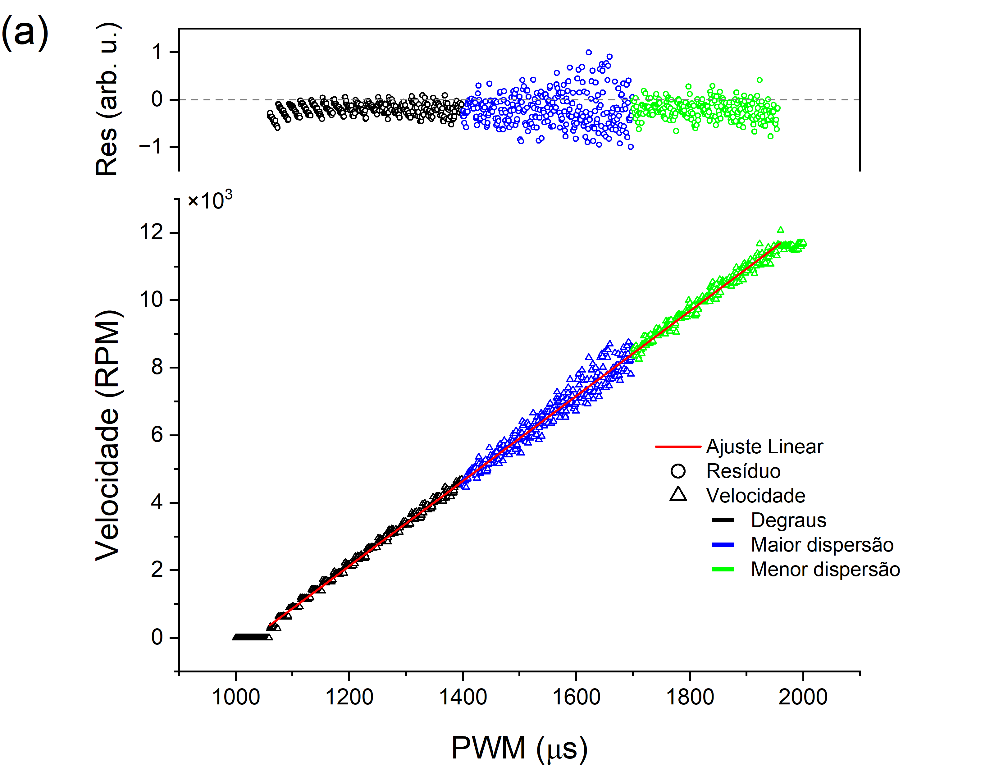
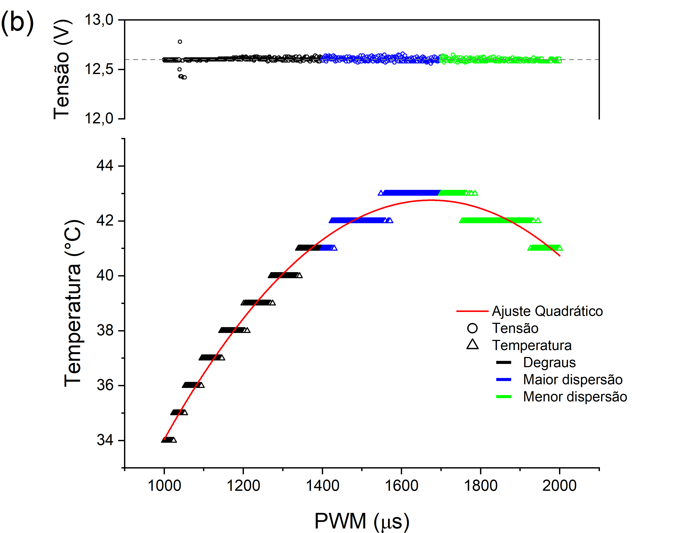
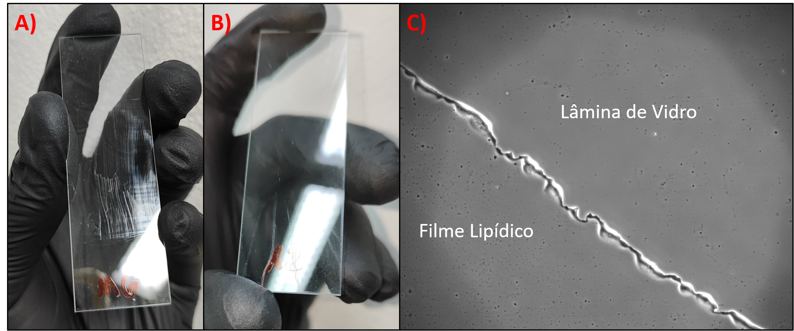

# Spin Coater (DIY)

Este projeto consiste no desenvolvimento e validação de um **Spin Coater de baixo custo (DIY)** voltado para a instrumentação e preparação de amostras em biofísica de membranas. Utilizando peças impressas em 3D, componentes de drones e um microcontrolador ESP32, o equipamento foi projetado para produzir filmes lipídicos finos e homogêneos sobre lâminas de vidro com alta reprodutibilidade.

---

## 📺 Demonstração em Vídeo

Você pode conferir o funcionamento prático do Spin Coater através do vídeo abaixo (disponível localmente no repositório):

  <video src="VID_20260306_151339.mp4" width="400px" controls>
    Seu navegador não suporta a reprodução de vídeos.
  </video>

## 📺 Demonstração em Vídeo

> 🎥 *Clique na imagem acima para assistir ao funcionamento do Spin Coater no YouTube Shorts.*

---

## 🛠️ Especificações de Hardware e Eletrônica

O projeto integra hardware de modelagem própria e componentes robustos gerenciados pelo ESP32.

### 🔌 Diagrama Elétrico
Abaixo está o esquema de conexões da eletrônica, englobando a fonte chaveada, o conversor de tensão DC-DC, o microcontrolador e a telemetria do motor:

*   **Microcontrolador:** ESP32 DevKit v1
*   **Motorização:** Motor Brushless Outrunner 980KV (comum em drones) acoplado a um ESC Brushless de 40A com telemetria ativa.
*   **Interface Física:** Display OLED I2C (SSD1306 128x64) e um Encoder Rotativo EC11 com botão integrado para navegação nos menus.
*   **Sinalização:** LEDs indicadores (Verde/Vermelho) para status de operação segura.

### 📐 Estrutura Física e Modelagem 3D (OpenSCAD)
O gabinete externo e o arranjo dos componentes internos foram inteiramente modelados em OpenSCAD. A carcaça estrutural foi projetada com **5mm de espessura**, permitindo um preenchimento do tipo *Gyroid* (efeito sanduíche) para minimizar tensões térmicas e vibrações de alta rotação.

A câmara de centrifugação utiliza uma **forma de alumínio de 16cm de diâmetro**, fixada à base por parafusos M6 e isolada por amortecimento de EVA para conter respingos e estabilizar mecanicamente o sistema. Os pés do gabinete possuem furação para parafusos M8.

Aqui está o equipamento montado e finalizado:

  
  

---

## 💻 Arquitetura do Firmware (ESP32)

O código desenvolvido em C++ implementa uma máquina de estados robusta (`TELA_HOME`, `TELA_CONFIG`, `MODO_DEPOSICAO`, `MODO_SPIN`, `MODO_FREIO`, etc.) e algoritmos críticos de automação industrial:

1.  **Vencimento de Inércia (*Kickstart*):** Ao iniciar, o motor recebe um pulso de PWM de $1150\,\mu\text{s}$ por $150\,\text{ms}$ para vencer o peso inicial do mandril de fixação (*chuck*).
2.  **Rampa de Aceleração Controlada:** Aceleração linear com duração fixa de $2000\,\text{ms}$ para evitar o descolamento abrupto da solução lipídica.
3.  **Compensador de Carga Ativo:** Em alta rotação (acima de $4650\text{ RPM}$), o firmware faz leituras contínuas da telemetria a cada $200\,\text{ms}$. Se a rotação real desviar mais de $100\text{ RPM}$ do alvo (`TOLERANCIA_CARGA`), o PWM é ajustado dinamicamente via software para compensar o arrasto aerodinâmico.
4.  **Frenagem Dinâmica Suave:** O motor desacelera em passos controlados de PWM para impedir danos ao eixo do motor ou deslocamento indesejado da amostra antes do corte total de inércia.

---

## 📊 Resultados e Validação

O sistema foi rigorosamente calibrado e testado para avaliar a estabilidade eletrônica, o comportamento mecânico e a qualidade biológica dos filmes obtidos.

### 📈 Calibração de Velocidade e Resíduos
A resposta de velocidade (RPM) em função do sinal PWM ($\mu\text{s}$) apresentou excelente comportamento linear em toda a faixa de operação do motor. A dispersão dos resíduos se mantém muito baixa, permitindo alta fidelidade na seleção da rotação.

### 🌡️ Tensão e Temperatura
A telemetria monitorou a temperatura do ESC e a tensão da fonte durante os testes. A temperatura segue um ajuste quadrático esperado devido ao efeito Joule, estabilizando-se em níveis seguros abaixo de $44^\circ\text{C}$, enquanto a tensão da fonte chaveada permanece perfeitamente estável em torno de $12.6\text{ V}$.

### 🔬 Homogeneidade das Amostras Lipídicas
O teste definitivo de bancada validou o propósito biológico do equipamento. Na imagem abaixo, é possível ver o contraste entre uma deposição manual (A) e o filme lipídico uniforme gerado pelo Spin Coater (B). Sob microscopia (C), a transição nítida evidencia a formação de um filme extremamente fino e homogêneo sobre a lâmina de vidro.

---

## 🛠️ Como Executar o Projeto

1.  **Modelagem 3D:** Os arquivos `.scad` podem ser modificados e exportados para `.STL` utilizando o [OpenSCAD](https://openscad.org/).
2.  **Firmware:** 
    *   Abra o código na Arduino IDE ou PlatformIO.
    *   Instale as bibliotecas necessárias: `Adafruit_GFX`, `Adafruit_SSD1306` e `ESP32Servo`.
    *   Compile e faça o upload para o ESP32 conectado às pinagens indicadas no cabeçalho do código.

---
*Desenvolvido por **Igor** como parte de soluções instrumentais aplicadas à pesquisa científica.*
